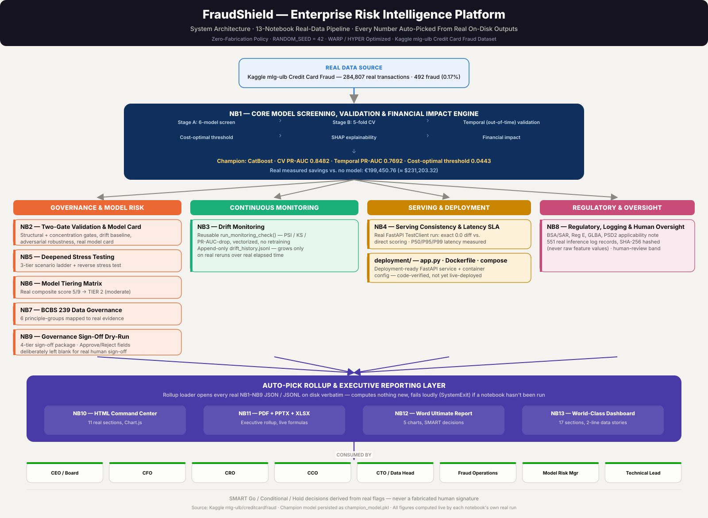

<div align="center">

# 🛡️ FraudShield
### Enterprise Risk Intelligence Platform

**One champion model. Thirteen real notebooks. Zero fabricated numbers — from raw transaction data all the way to a governance sign-off that never fakes a human signature.**

[](https://github.com/rnanda19/FraudShield_Enterprise_Risk_Intelligence_Platform/actions/workflows/ci.yml)
[](requirements.txt)
[](LICENSE)
[](#-what-this-is--and-isnt)
[](#-notebook-index)
[](docs/readiness_score_report.md)

</div>

<br>



<br>

## ⚡ Why this repo is different

Most fraud-detection portfolios stop at a confusion matrix. This one doesn't.

**The threshold is chosen to minimize real dollars lost, not to maximize a metric.** Two independently sourced industry cost benchmarks (LexisNexis, Aite-Novarica/Statista via Riskified) drive a vectorized cost-optimal search — not 0.5, not accuracy, not F1.

**Every claim is honest about what it is.** Cross-validated PR-AUC and honest out-of-time PR-AUC are both reported, side by side, even when they disagree. Adversarial robustness is measured, not assumed. A governance readiness score is published at **8.89/10** with the exact remaining gaps named — not rounded up to look finished.

**Nothing downstream ever recomputes or guesses.** Four independent executive-reporting formats (HTML dashboards, PDF/PPTX/XLSX, a Word report) all auto-pick every figure straight from the upstream notebook's real on-disk output. If a prerequisite notebook hasn't been run, the pipeline fails loudly and names exactly what's missing — it never fills the gap with an estimate.

**No notebook ever signs its own governance approval.** The four-tier sign-off package is auto-assembled from real evidence, with every Approve/Reject checkbox and every Name/Date/Signature field deliberately left blank for an actual human.

<br>

## 📊 Real headline results

| Metric | Value | Basis |
|---|---|---|
| Champion model | **CatBoost** | Highest Stage A PR-AUC, confirmed in Stage B CV |
| Champion 5-fold CV PR-AUC | **0.8482** (95% CI 0.8162–0.8784) | MEASURED |
| Runner-up (RandomForest) CV PR-AUC | 0.8448 (95% CI 0.8150–0.8739) | MEASURED |
| Temporal-split PR-AUC | **0.7692** | MEASURED — honest, held-out-in-time |
| Cost-optimal threshold | 0.0443 | MEASURED, vectorized O(n log n) search |
| Precision / Recall (out-of-fold) | 69.64% / 82.52% | MEASURED |
| Savings vs. no-model baseline | **€199,450.76** (≈ $231,203.32) | MEASURED |
| Model tier (NB6 rubric) | **Tier 2** — moderate materiality | MEASURED, composite score 5/9 |
| BCBS 239 governance gate | **PASS** | 6 principle-groups mapped to real evidence |
| Governance sign-off readiness | 21/30 checks Pass (10/12 · 7/7 · 2/5 · 2/6 by tier) | MEASURED, human fields deliberately blank |
| Serving latency (server-reported P99) | 0.38 ms | MEASURED, FastAPI TestClient |

<br>

## 📌 What this is — and isn't

This is a real, end-to-end **credit card fraud detection platform** — not a single Kaggle notebook. Thirteen notebooks carry one champion model through screening, statistical validation, deployment testing, continuous monitoring, stress testing, model tiering, BCBS 239 data governance, regulatory/inference-logging disclosure, a four-tier governance sign-off dry-run, and four independent executive-reporting formats.

It is honestly **not** a live production deployment. `deployment/app.py` is a real, tested FastAPI service — NB4 proves exact 0.0 prediction drift between the API and direct scoring, plus real measured latency — but it has never been run behind a live endpoint. See [`docs/readiness_score_report.md`](docs/readiness_score_report.md) for the full, versioned, honest gap list (currently 8.89/10 — not rounded up).

<br>

## 🧭 Notebook index

<details open>
<summary><b>Click to expand / collapse the full 13-notebook pipeline</b></summary>

| # | Notebook | What it does |
|---|---|---|
| 01 | `01_fraud_detection_full_analysis_SINGLE_CHUNK.ipynb` | EDA → 6-model screening → 5-fold CV → temporal validation → cost-optimal threshold → SHAP → financial impact. Produces the champion model everything else depends on. |
| 02 | `02_fraud_detection_validation_deployment.ipynb` | Two-gate structural/concentration validation, drift baseline, adversarial robustness, real model card. |
| 03 | `03_fraud_detection_continuous_monitoring.ipynb` | Reusable, rerunnable drift-monitoring check; appends to a persistent `drift_history.jsonl` on every real run. |
| 04 | `04_fraud_detection_serving_consistency_latency.ipynb` | Runs the real `deployment/app.py` FastAPI service via TestClient; training-serving consistency + latency SLA. |
| 05 | `05_fraud_detection_deepened_stress_testing.ipynb` | 3-tier stress scenario ladder, 105-combination vectorized grid, reverse stress test, Amount-shock re-scoring. |
| 06 | `06_fraud_detection_model_tiering_matrix.ipynb` | Disclosed-rubric materiality tiering across financial exposure, regulatory scrutiny, customer impact — real Tier 2 result. |
| 07 | `07_fraud_detection_bcbs239_data_governance.ipynb` | Rerunnable data-quality gate + BCBS 239 principle-group mapping against real project evidence. |
| 08 | `08_fraud_detection_regulatory_inference_logging_oversight.ipynb` | Regulatory applicability note, real `InferenceLogRecord` schema (551 real records, SHA-256 hashed features), human-oversight uncertainty band. |
| 09 | `09_fraud_detection_governance_dry_run.ipynb` | Auto-populates a real 4-tier governance sign-off package from NB1–NB8's artifacts; every human decision field deliberately left blank. |
| 10 | `10_fraud_detection_command_center_dashboard.ipynb` | Offline, self-contained HTML "Command Center" — 11 real sections, 3 slicers, Chart.js embedded as base64. |
| 11 | `11_fraud_detection_executive_rollup_reports.ipynb` | One run produces a PDF, a PPTX deck, and a live-formula XLSX workbook — role-based SMART decisions. |
| 12 | `12_fraud_detection_ultimate_word_report.ipynb` | Full Word report — 10 sections, 5 charts, SMART decisions by role, sourced-constants appendix. |
| 13 | `13_fraud_detection_worldclass_dashboard.ipynb` | Dark/light-theme interactive dashboard — 17 sections, 5 slicers, 2-line auto-generated data stories per chart. |

Each notebook is self-contained (one markdown intro + one code cell) and safe to re-run — outputs are written idempotently to `reports/nb<N>_results/`.

</details>

<br>

## 🚀 Quickstart

```bash
pip install -r requirements.txt
jupyter nbconvert --to notebook --execute notebooks/01_fraud_detection_full_analysis_SINGLE_CHUNK.ipynb
# then, in order, through:
jupyter nbconvert --to notebook --execute notebooks/13_fraud_detection_worldclass_dashboard.ipynb
```

Every notebook after NB1 checks for its real prerequisites on disk and fails loudly, naming exactly what's missing, rather than silently producing partial or estimated output.

<br>

## 🗂️ Repository layout

<details>
<summary><b>Click to expand the full tree</b></summary>

```
FraudShield_Enterprise_Risk_Intelligence_Platform/
├── data/
│   ├── raw/                                 # README_DOWNLOAD_CSV.md — real 98MB CSV not committed, see below
│   └── processed/
├── notebooks/                               # 13 real notebooks, NB1-NB13 (see index above)
│   └── starters/                            # earlier unexecuted 4-notebook sequence, superseded
├── src/                                     # reusable modules imported by the notebooks
│   ├── model_benchmark.py                   # Stage A screening, Stage B CV, temporal-split validation
│   ├── class_imbalance_utils.py             # cost-optimal threshold search (vectorized, O(n log n))
│   ├── adversarial_robustness.py            # perturbation + greedy boundary-search attacks
│   ├── drift_monitoring.py                  # PSI/KS feature-drift monitoring
│   ├── two_gate_validation.py               # Gate 1 structural checks, Gate 2 stress-test scenarios
│   ├── model_card_generator.py
│   └── notebook_01_starter.py
├── deployment/
│   ├── app.py                               # FastAPI scoring service (real, TestClient-verified)
│   ├── Dockerfile
│   ├── docker-compose.yml
│   └── requirements-api.txt
├── reports/                                 # real outputs of every notebook run
│   ├── Fraud_Detection_Command_Center.html
│   ├── Fraud_Detection_WorldClass_Dashboard.html
│   ├── Fraud_Detection_Platform_Master_Playbook.docx
│   └── nb1_results/ … nb13_results/         # raw JSON/JSONL results + figures + champion_model.pkl
├── docs/
│   ├── governance_signoff_template.md
│   └── readiness_score_report.md            # honest, versioned readiness score (currently 8.89/10)
├── publish_drafts/                          # draft external-facing copy
├── tests/
│   ├── _smoke_test.py                       # code-correctness smoke test, synthetic data only
│   └── test_app_smoke.py                    # FastAPI service smoke test (pytest)
├── scripts/
│   └── check_notebook_syntax.py             # CI-invoked notebook syntax/structure check
├── .github/workflows/ci.yml
├── CONTRIBUTING.md
├── ROADMAP.md
├── CHANGELOG.md
├── MODEL_CARD.md                            # pointer to the real model card (reports/nb2_results/model_card.md)
├── requirements.txt
└── .gitignore
```

</details>

<br>

## 💾 Raw dataset note

`data/raw/` intentionally ships **without** the 98 MB `creditcard.csv` to keep the repository light and fast to clone — `data/raw/README_DOWNLOAD_CSV.md` has exact download instructions (Kaggle: `mlg-ulb/creditcardfraud`). If you want the raw file tracked in git history, Git LFS is the recommended path:

```bash
git lfs install
git lfs track "data/raw/*.csv"
git add .gitattributes
```

<br>

## 🧱 Standing project rules

| Rule | What it means |
|---|---|
| **Zero-fabrication policy** | Every number is real/computed, never invented; anything not computed is an explicit, labeled `ASSUMPTION` |
| **WARP** | Runtime performance discipline: thread-ceiling env vars set before ML imports, ~92–93% CPU / never 100% cap, vectorization throughout |
| **HYPER** | Build/delivery-speed discipline: reusable templates, a shared inline "rollup loader" contract, batched reporting |
| **RANDOM_SEED = 42** | Everywhere, for reproducibility |

<br>

<div align="center">

*Built as part of a bank-breadth portfolio strategy covering top-tier financial institution activities.*

</div>
